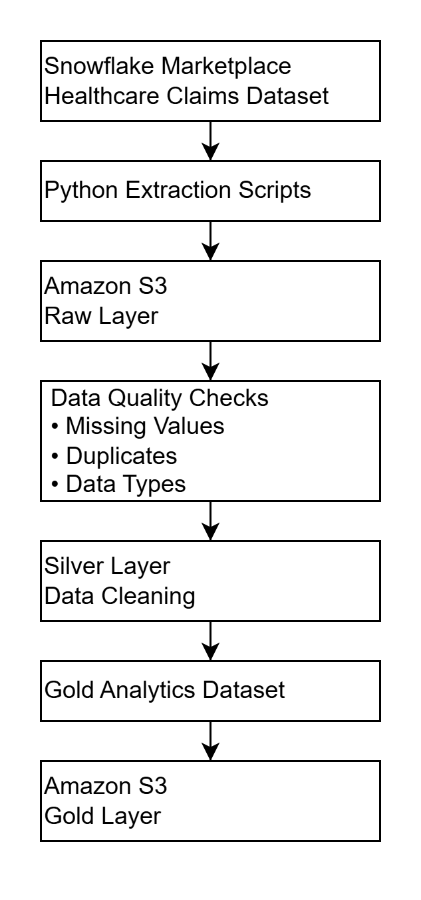

\# Healthcare Claims Data Engineering Pipeline


\## Project Overview


This project demonstrates an end-to-end healthcare data engineering pipeline using Python, Snowflake, Amazon S3, and data quality validation techniques.


The objective was to simulate how healthcare claims data moves through a modern data lake architecture by extracting raw data from a cloud data warehouse, validating data quality, transforming the data into curated datasets, and producing an analytics-ready Gold dataset.


The project follows a layered architecture consisting of Raw, Silver, and Gold data layers, similar to production data engineering pipelines.


\---


\## Architecture

<p align="center">
  
</p>


\### Pipeline Overview


1\. Extract healthcare claims data from Snowflake using Python.

2\. Load raw CSV files into the Amazon S3 Raw layer.

3\. Profile the raw data using reusable data quality checks.

4\. Transform the raw data into cleaned Silver datasets.

5\. Build an analytics-ready Gold dataset by joining the healthcare tables.

6\. Store the final Gold dataset in both CSV and Parquet formats in Amazon S3.


\---


\## Technologies Used


\* Python

\* Snowflake

\* Amazon S3

\* Pandas

\* PyArrow

\* python-dotenv

\* Snowflake Connector for Python

\* AWS CLI


\---


\## Dataset


Synthetic Healthcare Claims Dataset from the Snowflake Marketplace.


Core tables extracted:


\* CLAIMS

\* PATIENTS

\* PROVIDERS

\* PAYERS

\* ENCOUNTERS


\---


\## Project Workflow


\### 1. Data Extraction


Python connected securely to Snowflake using:


\* Username and Password

\* `.env` configuration

\* Multi-Factor Authentication (MFA)


Each table was extracted as CSV files and uploaded into the Raw layer of Amazon S3.


\---


\### 2. Raw Layer


Raw files were stored in Amazon S3 without transformation.


```text

raw/

├── claims.csv

├── patients.csv

├── providers.csv

├── payers.csv

└── encounters.csv

```


\---


\### 3. Data Quality Checks


A reusable quality checking module was developed to profile each dataset.


Checks included:


\* Duplicate primary keys

\* Missing values

\* Data type validation

\* Negative numeric values

\* Allowed categorical values


Quality reports were generated automatically for every extracted table.


\---


\### 4. Silver Layer


The Silver layer performed data cleaning and standardization.


Transformations included:


\* Removing duplicate records

\* Handling missing values

\* Standardizing data types

\* Basic data cleansing


The cleaned datasets were exported and uploaded to the Silver layer in Amazon S3.


\---


\### 5. Gold Layer


The Gold layer combined the healthcare claims data into a single analytics-ready dataset.


Outputs:


\* `healthcare\_claims\_analytics.csv`

\* `healthcare\_claims\_analytics.parquet`


These files are suitable for downstream analytics, reporting, dashboards, and business intelligence.


\---


\## Project Structure


```text

Healthcare-Claims-Data-Engineering-Project/

│

├── raw/

├── silver/

├── gold/

│

├── extract\_data.py

├── quality\_checks.py

├── profile\_raw\_tables.py

├── transform\_to\_silver.py

├── build\_gold.py

├── validate\_gold.py

│

├── README.md

├── requirements.txt

├── .env.example

└── .gitignore

```


\---


\## Data Validation


The final Gold dataset was validated for:


\* Duplicate Claim IDs

\* Missing values

\* Dataset dimensions

\* Referential consistency


Validation confirmed:


\* No duplicate Claim IDs

\* Gold dataset generated successfully

\* Analytics files successfully exported as both CSV and Parquet


\---


\## Lessons Learned


One of the most valuable lessons from this project involved sampling relational data.


Initially, each source table was extracted independently using `LIMIT 1000`. Although each table contained valid data, independent sampling broke the relationships between the datasets.


As a result, some patient attributes such as Age and Gender were missing after joining the tables because corresponding records were not always included in the sampled datasets.


In a production environment, a better approach would be:


1\. Sample the CLAIMS table first.

2\. Retrieve all related Patient IDs, Provider IDs, Payer IDs, and Encounter IDs.

3\. Extract matching records from the remaining tables using those IDs.


This preserves referential integrity and produces a much more complete analytics dataset.


Unfortunately, the Snowflake university account used for this project was decommissioned before the data could be re-extracted using this improved approach. Rather than rebuilding the project with a different dataset, the limitation has been documented to reflect a real-world engineering scenario and the lessons learned from the implementation.


\---


\## Future Improvements


Potential enhancements include:


\* Apache Airflow orchestration

\* Incremental data loading

\* Data partitioning strategies

\* Automated unit testing

\* Logging and monitoring

\* CI/CD pipeline integration

\* Infrastructure as Code (Terraform or AWS CloudFormation)

\* Data catalog and metadata management


\---


\## Author


\*\*Adaeze P. Nwaohiri\*\*


Master of Science in Data Analytics and Information Systems


Texas State University


